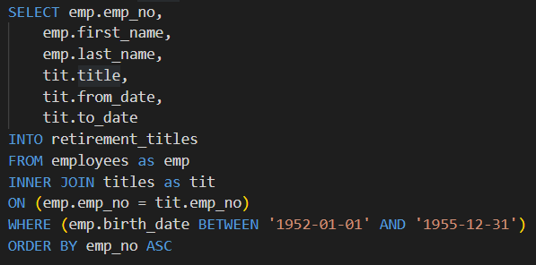
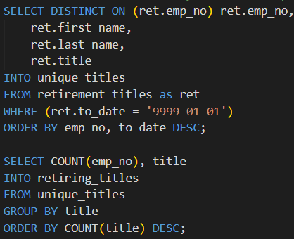
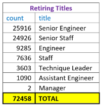
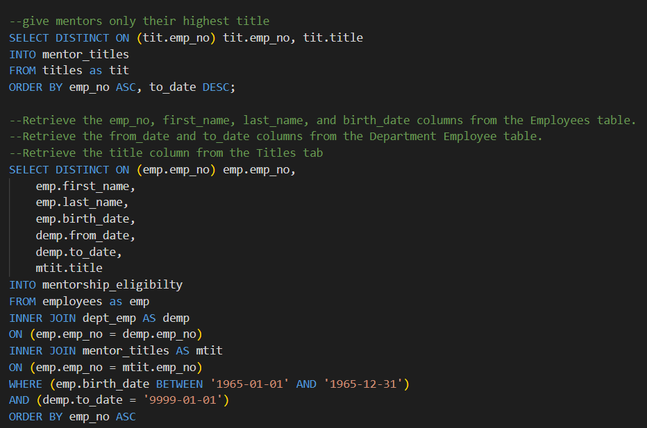

# Pewlett-Hackard-Analysis
## Overview of the analysis
The purpose of this analysis was to analyze data for the company "Pewlett Hackard” to determine “who” might be retiring in the next few years and “how many” vacancies will need to be filled.  We were given 6 different csv files and our 1st task was to build a data base with SQL with the information on tens of thousands of employees.  From the built database, we then did queries and “joins” to solve the question on “who” might be retiring and “how many” jobs will need new employees.   We were also tasked to find out employees (by age) who are eligible to participate in a mentorship program. 

[link to Employee Database ERD](pngs/EmployeeDB.png)  [link to Employee Database Schema](pngs/schema.sql)  

## Results
### Deliverable 1: The Number of Retiring Employees by Title
•	The 1st objective for this deliverable was to make a table with all of the employees who were born between 1952 and 1955.  The table (exported as retirement_titles.csv) included all the employee numbers, first name, last name, title, hire date, and last day (if applicable). This data had over 133,000 entries, but some of the entries were duplicates and some had already retired.  

•	The 2nd objective for this deliverable was used the “distinct on” syntax to get rid of the duplicates and delete anyone who had already retired.  The new updated table (exported as  [unique_titles.csv](https://github.com/manjamcmills/Pewlett-Hackard-Analysis/blob/main/Data/unique_titles.csv)) had 72,458 entries. 

•	The 3rd objective for this deliverable was to make a table (exported as [retiring_titles.csv](https://github.com/manjamcmills/Pewlett-Hackard-Analysis/blob/main/Data/retirement_titles.csv)) that calculated the number of possible retires by their most recent title.  As you can see, there will be many spots to fill! 

### Deliverable 2: The Employees Eligible for the Mentorship Program
•	The main objective of this deliverable was to do a new query that finds all the employees who were born between January 1, 1965 and December 31, 1965.  This was made into the “Mentorship Eligibility table” and exported as [mentorship_eligibilty.csv](https://github.com/manjamcmills/Pewlett-Hackard-Analysis/blob/main/Data/mentorship_eligibilty.csv).  

## Summary

### How many roles will need to be filled as the "silver tsunami" begins to make an impact?
•	72,458 roles will need to be filled as these employees start retiring. 

### Are there enough qualified, retirement-ready employees in the departments to mentor the next generation of Pewlett Hackard employees?
•	There are 1549 employees that could possibly mentor the next generation of Pewlett Hackard employees.  This should be enough but more research needs to be done to see if these employees are up for this role as a mentor. 
